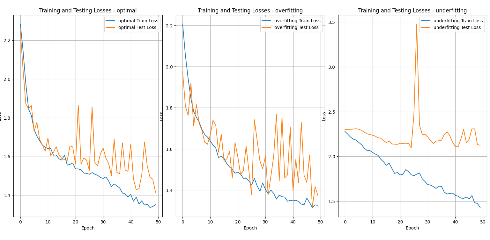
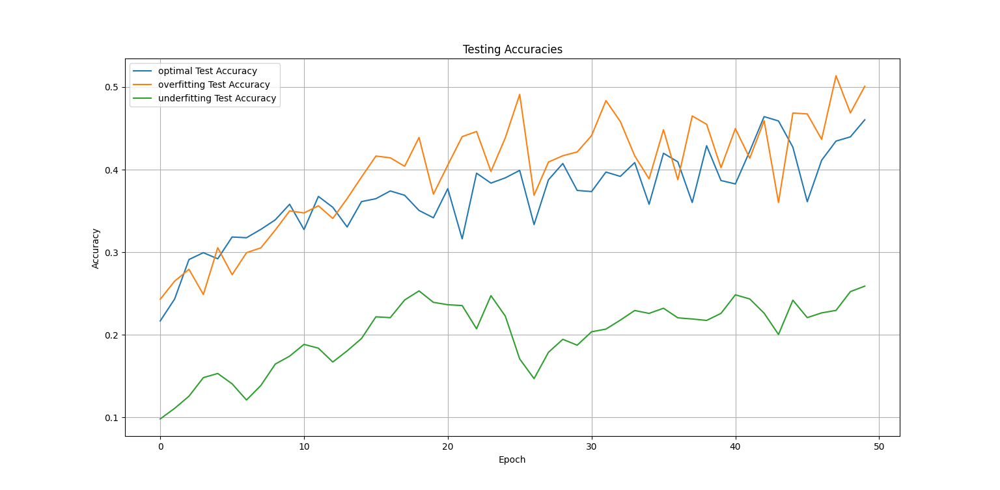
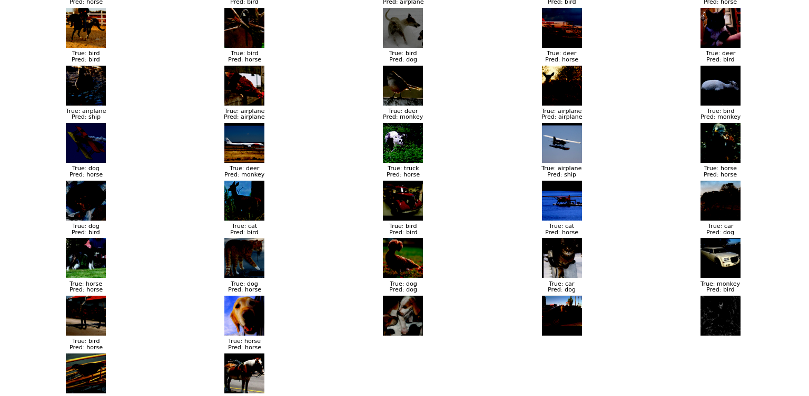
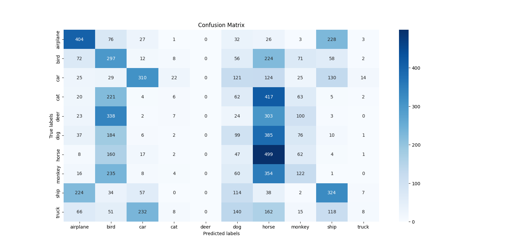
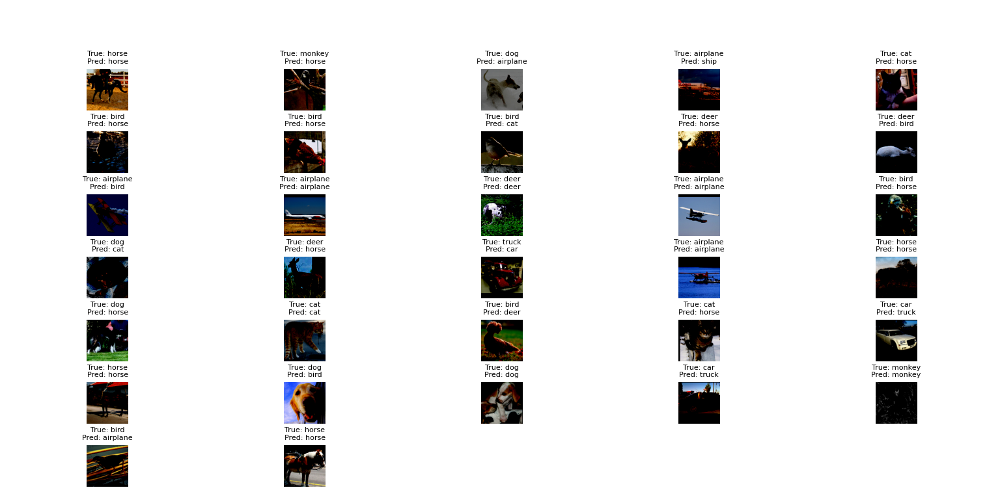
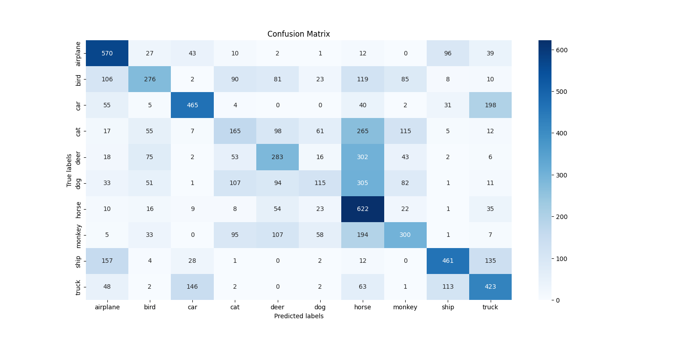
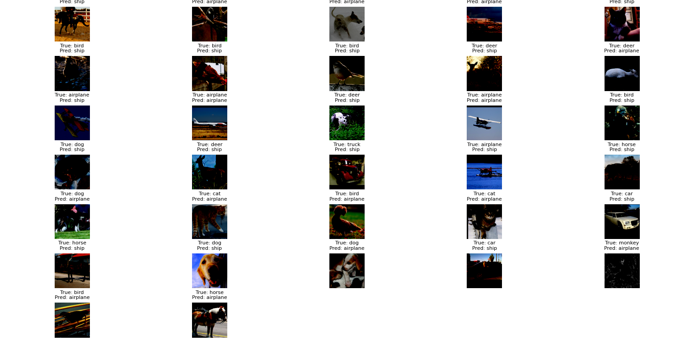
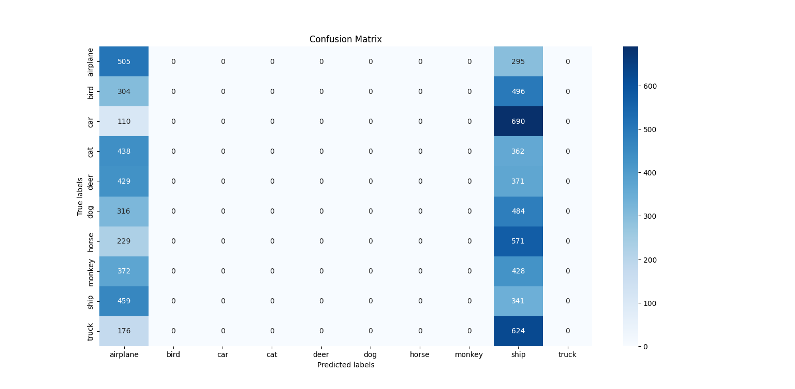

# Installation instructions

## System specification

Code run on cuda
Windows os used

## 1. Create venv, virtualenv or conda env

command used: python -m venv myenv

## 2. Activate venv or virtualenv

command used: myenv\Scripts\activate

## 3. Install project in editable mode

command used: pip install -e .

## 4. Install missing hardware-specific dependencies (PyTorch)

command used: pip install torch torchvision torchaudio
pip install tqdm
pip install matplotlib
pip install scikit-learn
pip install seaborn
pip install numpy

## 5. Git commiting with the command line interface

command used: 
git add .
git commit -m "Initial Commit"
git push

## underfitting script

python train.py --results_csv ./../results --run_name underfitting --save_model_path ./../saved_models --data_root ./../data --subset_size 100 --batch_size 32 --epochs 50

## optimal script

python train.py --results_csv ./../results --run_name optimal --save_model_path ./../saved_models --data_root ./../data --subset_size 2000 --batch_size 64 --epochs 50

 ## overfitting script

python train.py --results_csv ./../results --run_name overfitting --save_model_path ./../saved_models --data_root ./../data --subset_size 4000 --batch_size 2 --epochs 50 

## Visualisation

## Comparison plots for Train Loss, Test Loss and Test Accuracy
## Combined for Optimal, underfitting and overfitting solution

## Confusion matrix for Underfitting solution

## Confusion matrix for Optimal Solution

## Confusion matrix for Overfitting Solution

